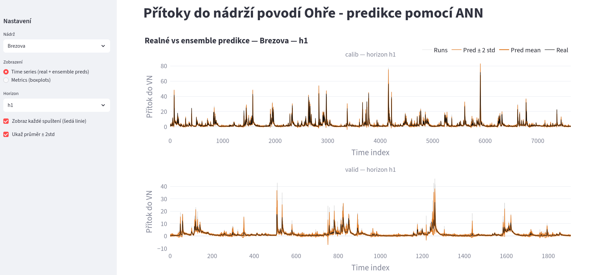
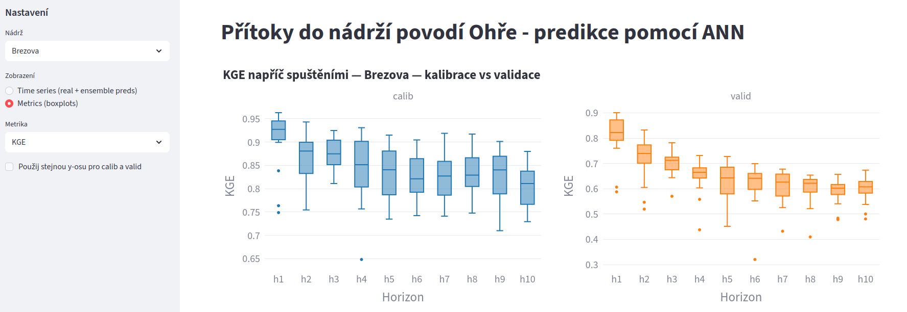

# ANN pro nádrže - Streamlit Dashboard

> **Vizualizace predikcí přítoků do nádrží povodí Ohře pomocí umělých neuronových sítí (ANN)**

A Streamlit-based interactive dashboard for exploring ANN-based inflow predictions for reservoirs in the Ohře river basin. The app supports multi-run ensemble visualization and metric evaluation across calibration and validation periods.

---

## Screenshot




---

## Features

- **Time Series View** - plot observed vs. ensemble-predicted inflows for any forecast horizon, with optional display of individual ensemble members and a ±2 standard deviation uncertainty band
- **Metrics View** - side-by-side boxplots of performance metrics (e.g. NSE, RMSE, KGE) across all ensemble runs, for both calibration and validation datasets
- **Multi-reservoir support** - any folder placed next to `app.py` is automatically detected as a separate reservoir/station
- **Flexible horizon support** - any number of forecast horizons (`h1`, `h2`, ..., `hN`) is supported

---

## Requirements

```
streamlit
numpy
pandas
matplotlib
plotly
```

Install with:

```bash
pip install streamlit numpy pandas matplotlib plotly
```

---

## Running the App

```bash
streamlit run app.py
```

---

## Expected Directory Structure

Each reservoir is represented by a subfolder placed **in the same directory as `app.py`**:

```
app.py
<reservoir_id>/
└── outputs/
    ├── calib_real.csv
    ├── valid_real.csv
    ├── calib_pred_1.csv
    ├── calib_pred_2.csv
    ├── ...
    ├── valid_pred_1.csv
    ├── valid_pred_2.csv
    ├── ...
    └── metrics/
        ├── calib_metrics_run1_NSE.csv
        ├── calib_metrics_run2_NSE.csv
        ├── valid_metrics_run1_NSE.csv
        └── ...
```

Multiple reservoirs are supported by simply adding more top-level folders.

---

## File Format Reference

### `<dataset>_real.csv`

Observed values. One column per forecast horizon.

| h1 | h2 | h3 |
|----|----|----|
| 12.3 | 11.8 | 10.5 |
| ... | ... | ... |

### `<dataset>_pred_<run>.csv`

Predicted values for a single ensemble run. Same column structure as the real file.

| h1 | h2 | h3 |
|----|----|----|
| 12.1 | 11.5 | 10.2 |
| ... | ... | ... |

### `<dataset>_metrics_run<N>_<METRIC>.csv`

Single-row CSV with one column per horizon containing the metric value for that run.

| h1 | h2 | h3 |
|----|----|----|
| 0.91 | 0.88 | 0.85 |

---

## Sidebar Controls

| Control | Description |
|--------|-------------|
| **Nádrž** | Select the reservoir/station to display |
| **Zobrazení** | Switch between Time Series and Metrics (boxplot) views |
| **Horizon** | Select forecast horizon (`h1`, `h2`, ...) |
| **Zobraz každé spuštění** | Toggle visibility of individual grey ensemble member lines |
| **Ukaž průměr ± 2std** | Toggle the orange uncertainty band around the ensemble mean |
| **Metrika** | Select the metric to plot in boxplot view |
| **Stejná y-osa** | Force calibration and validation panels to share the same y-axis scale |

---

## Notes

- The app automatically discovers all subfolders next to `app.py` as reservoirs - no configuration needed
- Ensemble member count is inferred from the number of `*_pred_*.csv` files present
- Missing `calib_real.csv` or `valid_real.csv` files result in a disabled panel rather than a crash
- Metric file names must follow the pattern `<dataset>_metrics_run<N>_<METRIC>.csv` exactly
