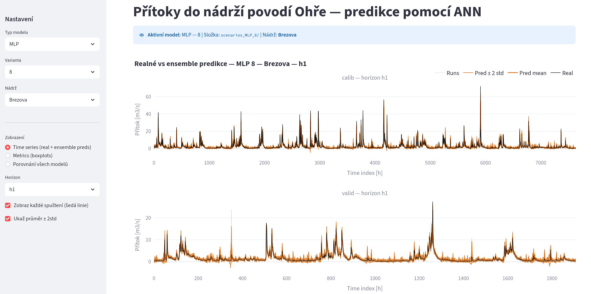
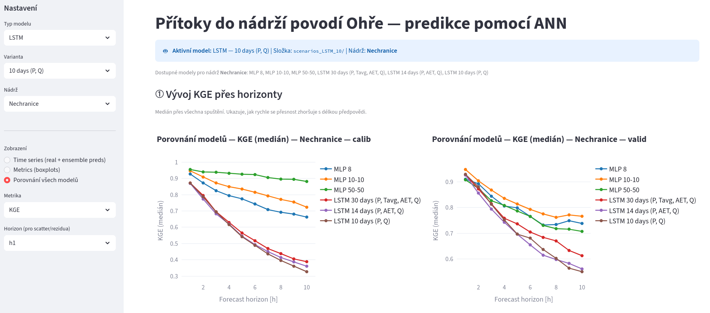

# ANN pro nádrže — Streamlit Dashboard

> **Vizualizace predikcí přítoků do nádrží povodí Ohře pomocí umělých neuronových sítí (ANN)**

A Streamlit-based interactive dashboard for exploring ANN-based inflow predictions for reservoirs in the Ohře river basin. Supports multi-model comparison, multi-run ensemble visualization, and metric evaluation across calibration and validation periods.

---

## Screenshots


---

## Features

### Single-model views
- **Time Series View**: observed vs. ensemble-predicted inflows for any forecast horizon, with optional display of individual ensemble members and a ±2 standard deviation uncertainty band
- **Metrics View**: side-by-side boxplots of performance metrics (e.g. NSE, RMSE, KGE) across all ensemble runs, for both calibration and validation datasets

### Multi-model comparison view
Compares all available MLP and LSTM variants simultaneously for the selected reservoir across eight diagnostic panels:

| # | Panel | What it shows                                                                                                    |
|---|-------|------------------------------------------------------------------------------------------------------------------|
| ① | **Metric line chart** | Median metric vs. forecast horizon - one line per model; reveals how quickly accuracy degrades with lead time    |
| ② | **Heatmap** (model × horizon) | Full at-a-glance overview of median metric values; colour-coded with automatic good/bad direction per metric     |
| ③ | **Side-by-side boxplots** | Median and run-to-run variability of each model at the selected horizon                                          |
| ④ | **Summary table** | Exact median values for all models, horizons, and both datasets; green/red gradient matches the metric direction |
| ⑤ | **Scatter: Real vs Pred mean** | One panel per model; perfect model lies on the 1:1 diagonal                                                      |
| ⑥ | **Residual time series** | Pred mean - Real over time; reveals systematic bias and drift                                                    |
| ⑦ | **Residual histogram** | Error distribution per model; ideally narrow, symmetric, centred at zero                                         |


### General
- **Multi-model support**: MLP (single and two hidden layers) and LSTM (multiple history window lengths) are all registered in one catalogue at the top of the script
- **Multi-reservoir support**: any subfolder inside a scenario directory is automatically detected as a reservoir
- **Flexible horizon support**: any number of forecast horizons (`h1`, `h2`, …, `hN`) is supported
- **Smart metric colouring**: the heatmap and summary table automatically apply green-is-good or green-is-bad colour scales depending on the metric (configurable via `METRIC_HIGHER_IS_BETTER` at the top of the script)

---

## Requirements

```
streamlit
numpy
pandas
plotly
```

Install with:

```bash
pip install streamlit numpy pandas plotly
```

---

## Running the App

```bash
streamlit run app.py
```

---

## Directory Structure

The app expects one scenario folder per model variant, placed next to `app.py`. Each scenario folder contains one subfolder per reservoir.

```
app.py
scenarios_MLP_8/
├── Brezova/
│   └── outputs/
│       ├── calib_real.csv
│       ├── valid_real.csv
│       ├── calib_pred_1.csv
│       ├── calib_pred_2.csv
│       ├── ...
│       ├── valid_pred_1.csv
│       ├── valid_pred_2.csv
│       ├── ...
│       └── metrics/
│           ├── calib_metrics_run1_NSE.csv
│           ├── calib_metrics_run2_NSE.csv
│           ├── valid_metrics_run1_NSE.csv
│           └── ...
├── Horka/
│   └── outputs/
│       └── ...
└── ...
scenarios_MLP_10-10/
scenarios_MLP_50-50/
scenarios_LSTM_30/
scenarios_LSTM_14/
scenarios_LSTM_10/
```

### Registering models

The model catalogue is defined in `MODEL_TYPES` near the top of `app.py`:

```python
MODEL_TYPES = {
    "MLP": {
        "8":        "scenarios_MLP_8",
        "10-10":    "scenarios_MLP_10-10",
        "50-50":    "scenarios_MLP_50-50",
    },
    "LSTM": {
        "30 days (P, Tavg, AET, Q)": "scenarios_LSTM_30",
        "14 days (P, AET, Q)":       "scenarios_LSTM_14",
        "10 days (P, Q)":            "scenarios_LSTM_10",
    },
}
```

To add a new model variant, add one entry to `MODEL_TYPES` and create the corresponding folder.

---

## File Format Reference

### `<dataset>_real.csv`

Observed values. One column per forecast horizon.

| h1 | h2 | h3 |
|----|----|----|
| 12.3 | 11.8 | 10.5 |
| … | … | … |

### `<dataset>_pred_<run>.csv`

Predicted values for a single ensemble run. Same column structure as the real file.

| h1 | h2 | h3 |
|----|----|----|
| 12.1 | 11.5 | 10.2 |
| … | … | … |

### `<dataset>_metrics_run<N>_<METRIC>.csv`

Single-row CSV with one column per horizon containing the metric value for that run.

| h1 | h2 | h3 |
|----|----|----|
| 0.91 | 0.88 | 0.85 |

---

## Sidebar Controls

### Common controls (all views)

| Control | Description |
|---------|-------------|
| **Typ modelu** | Select model family: MLP or LSTM |
| **Varianta** | Select specific architecture or input window within the chosen family |
| **Nádrž** | Select the reservoir / station to display |
| **Zobrazení** | Switch between Time Series, Metrics, and Comparison views |

### Time Series view

| Control | Description |
|---------|-------------|
| **Horizon** | Forecast horizon to display (`h1`, `h2`, …) |
| **Zobraz každé spuštění** | Toggle individual grey ensemble member lines |
| **Ukaž průměr ± 2std** | Toggle the orange ±2 std dev uncertainty band around the ensemble mean |

### Metrics view

| Control | Description |
|---------|-------------|
| **Metrika** | Performance metric to display in boxplots |
| **Použij stejnou y-osu** | Force calibration and validation panels to share the same y-axis scale |

### Comparison view

| Control | Description |
|---------|-------------|
| **Metrika** | Metric shown in the line chart, heatmap, boxplot, and summary table |
| **Horizon** | Forecast horizon used for the scatter plot, residual plots, histogram, and Taylor diagram |

---

## Metric Colour Direction

The heatmap (panel ②) and summary table (panel ④) use a green-is-good / red-is-bad colour scale. The direction is configured in `METRIC_HIGHER_IS_BETTER` at the top of `app.py`:

| Metric | Direction |
|--------|-----------|
| KGE, NS / NSE, PI, R², CORR | ↑ higher = better → large value is green |
| MSE, RMSE, RSR, PBIAS, MAE | ↓ lower = better → small value is green |

Unknown metrics default to lower-is-better. Add new metrics to the dictionary as needed.

---

## Notes

- The active model type, variant, folder, and reservoir are always shown in a banner at the top of the page
- The comparison view only includes models for which the selected reservoir folder actually exists - missing models are silently skipped
- Ensemble member count is inferred from the number of `*_pred_*.csv` files present
- Missing `calib_real.csv` or `valid_real.csv` files result in a disabled panel rather than a crash
- Metric file names must follow the pattern `<dataset>_metrics_run<N>_<METRIC>.csv` exactly